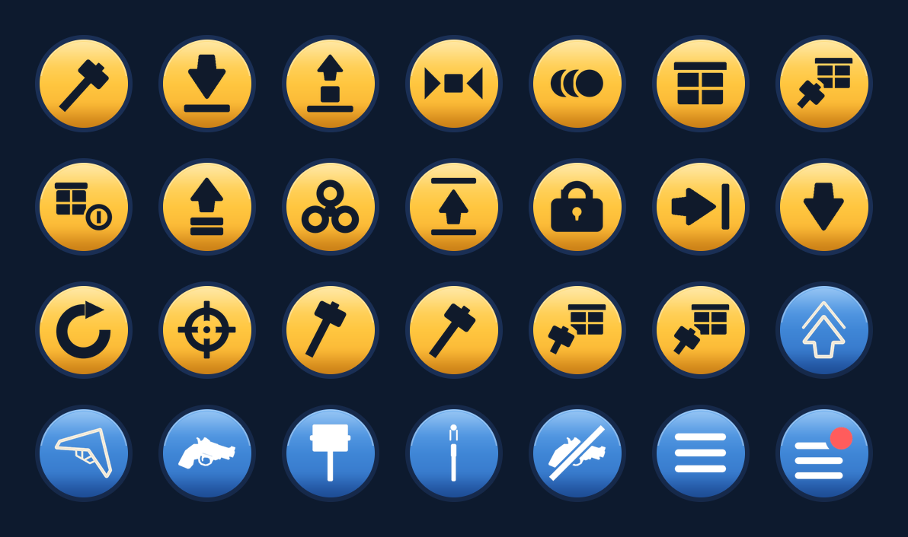

# Rob a Base


**How rich can you get before someone robs you?**

Smash crates, put your loot on show, and it earns while you are away. Lock your door, arm a
sentry, or go rob theirs. A multiplayer tycoon-theft game for the Decentraland mobile app. 

World: `basewar.dcl.eth`.

| Play | Link |
|---|---|
| Phone (Decentraland mobile app) | https://mobile.dclexplorer.com/open?realm=basewar.dcl.eth |
| Desktop | https://decentraland.org/jump?realm=basewar.dcl.eth |
| Listing | https://decentraland.org/places/world/?name=basewar.dcl.eth |

## The loop

The first five steps are the in-game tutorial, in its order.

1. **Place your base.** Put it on the green ground. A starter crate is already waiting.
2. **Smash a crate.** Three hits, out comes your first item. 7 rarities, 14 mutations.
3. **Put your item on show.** It earns while you play and while you sleep. Come back, tap COLLECT.
4. **Buy a crate.** Crates roll past and fall off the end. Yours walks home on its own, and
   anyone can outbid you on the way.
5. **Rob a base.** Tap a neighbour's item, stay put while the bar fills, run it home. They get
   the alert the moment you touch it. The way out is a shootout.
6. **Defend yours.** Lock the door, arm a sentry on every storey, lay traps, cloak, taser, bomb.
7. **Grow.** Twelve storeys, fusion, luck, skins, prestige, quests, daily rewards, a world
   leaderboard.
8. **Show up for the rush.** Random rushes, a grand rush every day at the same hour, boss battles on
   the plaza, raids on other bases.

## Mobile first



- One thumb plays the whole game: one action button, and its glyph shows what it will do.
- Every glyph above is generated by a script in `tools/ui/` and brought to one optical extent,
  so no verb reads heavier than another. `images/hud-buttons.png` is regenerated by
  `tools/ui/build-button-sheet.py`.
- The pad is measured on the mobile explorer's own controls: the jump and glider glyphs are the
  client's own files, and the arrows are its arrow, so our buttons and its buttons speak one
  language on the same arc.
- A theft is one tap and a timer: stay by the item and survive it.
- Desktop gets the same pad, scaled up. Both platforms play the same game.

## Social by design

- Everything on show can be stolen. The owner is alerted by name. Leaving is a shootout.
- Any crate on its way home can be outbid by anyone watching.
- Gift a base, or rob it.
- Sentry shots, door seals and rush calls are seen and heard by everyone on the plaza.
- Company pays: each player present raises everyone's income, up to 60 %.
- Owner names on every base sign, one leaderboard for the world.

## Why players come back

- The base earns for hours after you leave, and the welcome-back screen pays it out.
- Your loot stays a target while you are gone. Check on it.
- Daily reward on a seven-day cycle, quests, the grand rush at the same hour every day.
- Prestige resets the base for a permanent edge. Twelve storeys and a full collection to earn.

## A full world

- **Bases fair placement.** If the chosen square was just taken, the server places the
  base on the nearest free square and says so. Never a refusal.
- **Room is an object budget.** The phone renders about 400 objects; the
  server keeps a ledger of 385, each base charged what it really costs. When the ledger is
  full, the base of the player absent for longest steps off the field: nothing lost, it stops
  earning, it stands again on their return. A player who is present is never removed.
- **Detail follows the same budget.** Nearest bases in full, far ones as silhouettes, yours
  always full. A storey is 4 merged meshes instead of 23 objects; item models are shared.

## Verify in sixty seconds

- Open the phone link. No setup beyond the app itself.
- `1 MENU` shows a four-character build stamp: the deployed commit, compare with `git log`.
- `images/base-war-thumbnail.png` is byte-identical to what the Worlds content server serves.
- Live server logs: `npm run server-logs -- --world basewar.dcl.eth`.

## Under the hood

- Decentraland SDK7, multiplayer server branch (`@dcl/sdk@auth-server`). One codebase, the
  server runs headless on Decentraland's infrastructure, state in Decentraland `Storage`.
  No private backend.
- The server is authoritative: every roll, price, distance and theft is decided server-side.
  Clients only send intent.
- 94 message types, 34 server handlers, 13 validators on synced components, about 24,500
  lines of TypeScript, CI on every push.
- Every model, sound, texture, icon and avatar clip in `assets/` is generated by a script in
  `tools/`, except the pistol (open Decentraland catalog) and two joypad glyphs (`NOTICE.md`).

```
src/
  index.ts    entry point, server/client branching
  shared/     synced components, messages, economy, loot table, quests
  server/     belt, convoys, loot, theft, combat, gear, fusion, raids, events, records
  client/     rendering, input pad, HUD, plots, combat feel, toys, preload
tools/        generators for every asset, deploy and duo scripts, economy simulator
```

## Run it

```bash
npm install
npm run start        # local preview
npm run duo          # two players, two identities, one server
bash tools/deploy.sh # production build, build stamp, deploy to the world
```

## License

MIT, see [LICENSE](LICENSE). Attributions in [NOTICE.md](NOTICE.md).
